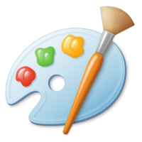

<div id="top"></div>

<!-- PROJECT LOGO -->
<br />
<div align="center">
  <a href="https://github.com/CampAsAChamp/msPaintAutomation">
    
  </a>

<h3 align="center">Microsoft Paint Automation</h3>

  <p align="center">
    Pick an image and this program will recreate that image using Microsoft Paint.
    <br />
    <br />
    <a href="https://github.com/CampAsAChamp/msPaintAutomation">View Demo</a>
    ·
    <a href="https://github.com/CampAsAChamp/msPaintAutomation/issues">Report Bug</a>
    ·
    <a href="https://github.com/CampAsAChamp/msPaintAutomation/issues">Request Feature</a>
  </p>
</div>


<!-- TABLE OF CONTENTS -->
<details>
  <summary>Table of Contents</summary>
  <ol>
    <li>
      <a href="#about-the-project">About The Project</a>
      <ul>
        <li><a href="#built-with">Built With</a></li>
      </ul>
    </li>
    <li>
      <a href="#getting-started">Getting Started</a>
      <ul>
        <li><a href="#prerequisites">Prerequisites</a></li>
        <li><a href="#installation">Installation</a></li>
      </ul>
    </li>
    <li><a href="#usage">Usage</a></li>
    <li><a href="#contributing">Contributing</a></li>
    <li><a href="#license">License</a></li>
  </ol>
</details>


<!-- ABOUT THE PROJECT -->
## About The Project

[![Product Name Screen Shot][product-screenshot]](https://example.com)

<p align="right">(<a href="#top">back to top</a>)</p>


### Built With

* [Python](https://nextjs.org/)
* [PyAutoGUI](https://pyautogui.readthedocs.io/en/latest/)
* [Pillow](https://pillow.readthedocs.io/en/stable/)

<p align="right">(<a href="#top">back to top</a>)</p>


<!-- GETTING STARTED -->
## Getting Started

### Prerequisites

* **Python 3**


### Installation

1. Clone the repo
    ```sh
    git clone https://github.com/CampAsAChamp/msPaintAutomation.git
    ```
2. Create virtual environment
    ```sh
    python -m venv .venv 
    ```
3. Activate virtual environment
    ```sh
    source ./venv/Scripts/Activate
    ```
4. Download dependencies
    ```sh
    pip install -r requirements.txt
    ```

<p align="right">(<a href="#top">back to top</a>)</p>


<!-- USAGE EXAMPLES -->
## Usage

1. Change Image Path in code to your image
   ```python
   18    image_file = 'C:\\Users\\Nick\\Pictures\\logo.jpg' # Change the path to the path to your image
   ```
2. Start Microsoft Paint in the background
3. Run this program (with the image_path variable replaced to your own), and switch to Microsoft Paint within 5 seconds of starting
4. Put cursor in the top left corner of the drawing canvas
5. Wait until finished (can take up to 10 minutes)
6. **If you want it to stop press CTRL + ALT + DEL and put your mouse in the top left corner of the screen**

<p align="right">(<a href="#top">back to top</a>)</p>


<!-- CONTRIBUTING -->
## Contributing

Contributions are what make the open source community such an amazing place to learn, inspire, and create. Any contributions you make are **greatly appreciated**.

If you have a suggestion that would make this better, please fork the repo and create a pull request. You can also simply open an issue with the tag "enhancement".
Don't forget to give the project a star! Thanks again!

1. Fork the Project
2. Create your Feature Branch (`git checkout -b feature/AmazingFeature`)
3. Commit your Changes (`git commit -m 'Add some AmazingFeature'`)
4. Push to the Branch (`git push origin feature/AmazingFeature`)
5. Open a Pull Request

<p align="right">(<a href="#top">back to top</a>)</p>


<!-- LICENSE -->
## License

Distributed under the MIT License. See `LICENSE.txt` for more information.

<p align="right">(<a href="#top">back to top</a>)</p>


<!-- MARKDOWN LINKS & IMAGES -->
<!-- https://www.markdownguide.org/basic-syntax/#reference-style-links -->
[contributors-shield]: https://img.shields.io/github/contributors/CampAsAChamp/msPaintAutomation.svg?style=for-the-badge
[contributors-url]: https://github.com/CampAsAChamp/msPaintAutomation/graphs/contributors
[forks-shield]: https://img.shields.io/github/forks/CampAsAChamp/msPaintAutomation.svg?style=for-the-badge
[forks-url]: https://github.com/CampAsAChamp/msPaintAutomation/network/members
[stars-shield]: https://img.shields.io/github/stars/CampAsAChamp/msPaintAutomation.svg?style=for-the-badge
[stars-url]: https://github.com/CampAsAChamp/msPaintAutomation/stargazers
[issues-shield]: https://img.shields.io/github/issues/CampAsAChamp/msPaintAutomation.svg?style=for-the-badge
[issues-url]: https://github.com/CampAsAChamp/msPaintAutomation/issues
[license-shield]: https://img.shields.io/github/license/CampAsAChamp/msPaintAutomation.svg?style=for-the-badge
[license-url]: https://github.com/CampAsAChamp/msPaintAutomation/blob/master/LICENSE.txt
[linkedin-shield]: https://img.shields.io/badge/-LinkedIn-black.svg?style=for-the-badge&logo=linkedin&colorB=555
[product-screenshot]: images/screenshot.png
